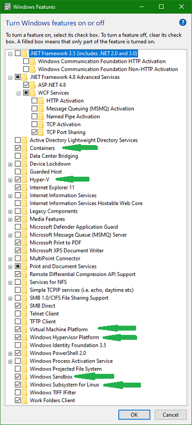
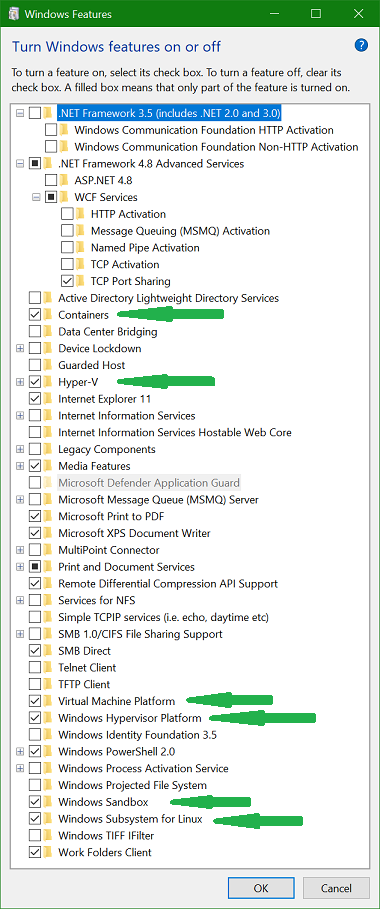

---
{
  "tags": 
  [
    "Virtualization"
    , "Docker"
    , "WSL"
    , "Windows/WSL Interop"
  ]
  , "Date": "2020-12-07"  
  , "Author": "Bruce Lackore, Lead Engineer, Arizona Office of the Courts  "
  , "Configuring a Windows machine to support":
    [
      "Virtualization using either Hyper-V or VMWare 16+"
      , "Docker within the virtualized environment"
      , "Windows Subsystem for Linux (WSL), version 2"
      , "SSH"
      , "Interoperability between the WSL environment and the Windows"
      ,"Environment"
    ] 
}
---

### Configure a basic Windows 10 Pro, v20H2 machine to support the following:

 1. Multiple virtual environments using either Microsoft's Hyper-V or VMWare's  
 VMWare version 16 or above (the author tested this process using VMWare 16.1)

 2. Windows Subsystem for Linux both on the host and within a virtual  
 machine.

 3. Interoperability between the Windows "host" and the SL sub-system  
 (calling one type of program, e.g. a Linux command, from within the Windows  
 environment, e.g. Powershell and vice-versa).

 4. Docker on the host and **within** a virtual machine (aka VM). Getting  
 Docker to work outside of a VM with WSL and Hyper-V installed is a bit tricky,  
 as of this writing Microsoft and/or VMWare have not come to grips with how to  
 make this process seamless.  

</b>

  
Definitions

Be warned, the definitions are both long and technical to a degree, therefore  
one should **NOT** "TL;DR" them. There is important information contained  
within that will explain and justify why this process is both desireable and  
necessary.

1. "Host": the physical machine. Can be running either Windows or Linux, this  
    document addresses only Windows machines.

2. "VM": **V**irtual **M**achine aka 'Virtual Session', aka simply 'Session'.  
    A software construct configured to replicate all the functionality of a  
    physical machine save the "machine" is pure software, a "computer within a  
    computer" if you will. Such VM's allow developers to construct environments  
    peculiar to a particular requirement or environment (software, not holistic)  
    for development purposes e.g. re-creating an outdated Windows XP environment  
    for the purposes of testing, maintaining, even operating in production of a  
    piece of software with requirements for Windows XP.  
    The hallmark of such a VM is that the session replicates _an entire  
    operating system_ that can be wildly different from that of the host e.g.  
    running a Linux OS VM on a Windows 10 host.

3. "Docker": an application which allows an application, or, more generally,  
    a process, to be "encased" within an isolated environment with just enough  
    of the necessary support mechanisms such that said process may exist and  
    execute within a chosen operating system environment e.g. Windows or Linux,  
    etc. In reality the process is much more complex than as explained above,  
    the key is to understand that the result of "dockerizing" a process results  
    in a small, replicable binary which contains the desired process along with  
    the "essence" of the hosting operating system but **NOT** the entire OS  
    itself.

4.  Docker "Container": The result of "Docker-izing" a process, the result  
    being a Docker "image" which is a binary file containing the process and a  
    tailor-made environment targeting a particular operating system e.g. one  
    might take a piece of software like the web browser "FireFox" and place it  
    into an image. One would need to specify the operating environment of the  
    image, e.g. Windows, Linux, etc. because the container that results from  
    using the image _can only be executed within the environment in which the  
    original image was targeted_.  

    For example, a Linux image **must** be executed in a container running on a  
    Linux host (and, yes the "host" in this case can be either the actual  
    physical machine or a VM).  
    However, the Docker folks have fixed up the "Docker" program such that it  
    will allow multiple OS images for as many environments as desired and allow  
    the user to select the desired image simply by name e.g. "FireFox" and the  
    Docker program will examine the host environment and select the appropriate  
    image for that environment (see the Docker documentation for an explanation  
    on how that's done).  
    The advantage? The container is smaller by several orders of magnitude (like  
    meg instead of gig), when launched, it does _not_ have to launch an entire  
    OS environment, just connect with the environment it's running in which  
    makes spin-up time **much** faster.  
    Also, **_and most importantly_**, the image is **_immutable_**. Once created  
    it **_cannot change_** which makes it virtually virus-proof. 
 
5. "Container vs Image": "Containers" are _instances_ of images. One creates  
    a "container" by requesting the Docker program to fetch an image,  
    "containerize" it and then give it a unique tag which can then be used to  
    execute the container, etc. This allows *many* containers to be created from  
    a *single* image, thus if a particular container becomes corrupted, stops  
    executing, gets hung up, whatever, one may simply stop the container then  
    either restart it or delete it and create another from the original image.  
    These containers may be executed on multiple machines in multiple locations  
    and, while having a very thin read-write layer, are virtually impossible to  
    get to simply because the entire container environment is locked down and  
    only those ports that are necessary to the operation of the container are  
    exposed, e.g. 80 for a standard website, 443 for an SSH website, etc.  
    **_EVERYTHING ELSE_** is locked out and, even if a hacker managed to breach  
    the container, changes and infections would be **_limited to that container_**  
    and the easy fix is to drop the container, re-create it from the immutable  
    (and therefore **_unchanged_** image) and start the new container. Takes a  
    matter of seconds to do and this process can even be automated (see  
    Kubernetes, which this document will not cover).  
    And, yes, persistent data *is* possible using "volumes", the author has a  
    complete "SQL Server" instance running in a Linux container that uses  
    these volumes to persist data from one Sql server update to the next.  
    More about Docker and volumes in another document.  
    
    One might wonder, "Well, how do updates get applied?". Easy answer -  
    re-create the _image_, drop and delete the _containers_ one at a time,  
    create new containers from the new image, execute the new containers. Again,  
    there is software (Kubernetes is one example) that will do this  
    automatically.  
    Combine with a repository that can respond to check-ins (aka a CI/CD  
    pipeline) and you have a system that can take care of itself, all the  
    developer need do is create the necessary code for the next image and check  
    it in. 
    Using this methodology also results in **much** more robust code in that  
    when the developer checks in new code for the next image, the CI/CD pipeline  
    can:
      * Run Unit tests and fail the check in if the unit tests fail.
      * Place a "gatekeeper" in front of the new code such that a human must  
        approve of the changes before that change is merged into the codebase  
        and used to create an image.
    * Once approved, the CI/CD software can build the _one and only_ image  
    **_that will be used for all other activities!_**
    * Once the image is created, again, the CI/CD software can create a  
      container from the image and post it up for testing and, again, place a  
      gatekeeper in front of the testing such that the image cannot advance  
      until the gatekeeper approves of the changes and the acceptance testing  
      has been completed.
    * Once the testing gatekeeper approves, **_the same image used for testing_**  
      can be moved to production.  
      **_NO CODE WILL CHANGE ONCE THE DEVELOPER CHECKS IN THEIR CHANGES_**.  
      So...no more "but it works on **my** machine" issues. In addition, once  
      Microsoft finishes their work, even the development environment won't be  
      local to the developer's machine, _it will be checked out just like any  
      other code_ so the dev environment itself will **always** be the same  
      regardless of developer.  
      The build environment is the same regardless of the developer,  
      the testing environment is going against a container built from an image  
      built by the build environment, once testing is complete, the _same image_  
      is used for production.  
    * Once again, a gatekeeper can be put in place such that the next version  
      of the software _cannot go into production_ until the gatekeeper approves  
      of the update and launches the update process, whatever that may be (again  
      all of this can be automated to a degree such that the only human  
      intervention required is that of the gatekeepers making the approvals.)

  6.  distro - A short form of the term "distribution" which refers to a  
      particular release of a Linux OS environment.

  
Goals

Configure a Windows machine such that, when completed, the host  
will support:
  * WSL 2 on both the host and within a session  
  * Hyper-V or VMWare for virtualization
  * Docker running in the vm supporting both Windows and Linux containers

  
Requirements

 * Windows 10 Pro, Version 1903, Build 18362 or higher
   * User _must_ be "Admin" on the host machine
   * User should not be limited in ability to change policies on the host  
   machine or make arrangements with the system administrator such that actions  
   such as running unsigned PowerShell scripts is not prohibited.
   * User should have access to Windows installation media to allow for changes  
   in configuration (Windows "Turn Windows features on and off") and, in the  
   case of the virtualization environment, e.g. Hyper-V or VMWare, allow for  
   the installation of Windows into the vm session.
   * User should have a Windows activation key(s) appropriate for the situation.
   * User should have access to the internet in (mostly) unrestricted form,  
   mainly for access to the Microsoft Store and group policy need allow access  
   to same.
 * VMware 15.5.5+ (if using VMWare as the host virtualization software)  
   * It should be noted that the author is not fond of Hyper-V and while this  
   document will describe the basic set-up for Hyper-V, only the basic  
   procedures described herein will be tested.
 * While not stated officially, the author recommends:
   * an i7 or higher Intel chip (or equivalent AMD - make sure it's supported!).
    * Said chip **_MUST_** support hardware virtualization _and_ virtualization  
    **must** be activated in the CPU BIOS.
   * At least 32G of RAM
   * At least 128G of available hard drive space (one can get away with less  
   but the virtual session files can grow very quickly so *room* is needed.)
   * The author tested with Windows 10 Pro 20H2, build 19042.662 in both the  
   host and virtual session environments.
   * The author tested with VMWare version 16.1.0 build 17198959

  
Presumptions

It is presumed that the user can perform the following actions:  
1.  Invoke the Control Panel to access "Programs and Features"
      * One may also access "Programs and Features" by:
        * Selecting "Settings"
        * Select "Apps" to open the "Apps and Features" page
        * On the "Apps" page, select "Programs and Features"
        * Or one may take a bit of a short-cut and simply right-click the  
          "Windows" button to get to the "Apps and Features" page
      * On the "Apps and Features" page, select "Programs and Features"
2.  Invoke an administrator level command prompt
3.  Invoke an administrator level PowerShell prompt
4.  Invoke the virtualization environment of their choice on the host  
5.  Create and configure a Windows virtual machine in the virtualization  
    environment of their choice.
6. Connect with, search and install items from the "Microsoft Store"

  
Software Needed

The following software should be obtained prior to beginning the installation  
and configuration process:  

   * [Docker for Windows][DockerForWindows-Url]  
   * [Git][Git-Url]
   * [Visual Studio Code][VisualStudioCode-Url]
   * [Visual Studio Code Insiders][VisualStudioCodeInsiders-Url]
   * [WSL 2 update package][WSL2UpdatePackage-Url]  
   * [(Optional) Beyond Compare Diff/Merge tool][BeyondCompare-Url]

###  Installation

  
Host Only

  * Ensure that all available updates have been applied.
  * Open "Apps & Features" (see methods described above), select "Optional  
  Features"
    * Examine the list, ensure that the OpenSSH client is installed (it  
      should be after the April 2018 release of Windows) or simply open a  
      command prompt and enter "ssh". If you get a response for "usage",  
      you're good.
  * Open "Programs and Features"  
  * Select "Turn Windows Features on and off"
    * Check "Containers"
    * Check "Hyper-V"
    * Check "Virtual Machine Platform"
    * Check "Windows Hypervisor Platform"
    * Check "Windows Sandbox" (for security)
    * Check "Windows Subsystem for Linux"

  * See diagram below

  * Reboot the system to install the new features
  * Open an administrative command prompt and execute the Linux kernel update  
    downloaded earlier [WSL 2 update package][WSL2UpdatePackage-Url]  
  * Again, reboot the system
  * Open an administrative PowerShell or administrative CMD prompt and execute  
    the following command:
      * wsl --set-default-version 2

    This should force all distros installed after this point to be converted  
    to WSL 2 but, just in case, the procedure to convert a WSL 1 distro to a  
    WSL 2 distro is included below.

  * It's time to install a Linux distro.
    * Open the Microsoft Store and select a distribution by searching for  
      "Linux" and selecting the desired package (distro).
    * Install the desired distribution.
    * Close the store, **_do not launch_** the distro.
    * Open an administrative PowerShell and execute the following:
      * wsl -l -v 
        * The "-l" is a lower-case letter "L"
        * This command will show you the state and version  
          of all the distros installed in WSL).
      * All of the installed distributions will be listed along with their  
        current running state and, more importantly, which version of WSL they  
        are currently operating under. The expected version should be "2"  
        as we set that as the default. However, if it isn't, the following  
        will convert the distro to 2. This may be done at any time.
      * Convert the distribution to WSL 2 by executing the following command:  
        * wsl --set-version \<distribution name\> 2
          * e.g. for Ubuntu 20.04, the command would be:  
            wsl --set-version Ubuntu-20.04 2
        
        You should receive a message to the effect that the conversion is  
        taking place and that it'll take a few minutes. Once complete, there  
        should be an icon available to launch the distro.  
        To verify that the conversion did indeed take place, re-run the  
        "wsl -l -v" command and observe that the version is now "2".  
        Click the icon to launch the distro.  
        The first time you launch the distro you will be asked for a user name  
        and password, enter as appropriate and then close the distro (we'll  
        open it later but there is more yet to do.)

    * Install [Visual Studio Code][VisualStudioCode-Url] and/or
    * Install [Visual Studio Code Insiders][VisualStudioCodeInsiders-Url]
    * Install [Git][Git-Url]  
      * Two options one should be offered whilst installing Git are:
        * Select your editor, please choose VSCode or VSCode-Insiders
        * Select how Git stores and retrieves files, please choose  
          Check-in as-is, check-out as Unix (guarantees that Windows crlf line  
          endings are converted to Linux lf. Windows understand this.)
      * After the install completes, do the following to configure Git:
        * git config --system core.longpaths true
        * git config --global user.name "\<Your name\>"
        * git config --global user.email \<Your Email address\>
        * git config --global core.autocrlf input
          * This last command ensures "Commit as-is, pull as Unix".
    * Once complete, re-open the installed Linux distro and execute the  
      following command:
        * code

      You should see a message to the effect that the Visual Studio Code  
      "server" is being downloaded and installed. Good! After completion,  
      VSCode should launch. You have just seen an example of inter-operation  
      between Linux and Windows - you launched Visual Studio Code from  
      _within_ the Linux distro yet it's running in Windows!  
      And, yes, _both_ file systems are available for access from _both_  
      environments (more later).
    * Close VSCode and return to the open distro and enter the command:
      * code-insiders

    You should see the same message about code-insiders server being downloaded  
    and installed. Again, VS Code insiders should launch.

    Authors' hint: While VSCode (either version) is open, you might want to  
    take the opportunity to install a few extensions. Here is a (by _no_  
    means complete) list of extensions to install:
      * Docker file editor
      * Docker Explorer
      * Anything "Remote" from Microsoft (this will allow remote execution of  
        VSCode within a container). VSCode itself should suggest the  
        "Remote-WSL" extension as it will recognize that you have WSL installed.
      * Markdown helpers as desired.

  * Install Docker
      * The initial installation screen should offer the choice of using WSL 2,  
        accept the choice (by default, as of this writing, the installer comes  
        up with all options checked, just leave it that way.)
      * Once the install is complete, rather than simply "sign out", reboot the  
        machine and allow it to settle.
      * Once rebooted, find and right-click the "whale" icon and attempt to  
        switch to "Windows" containers. You should see a message to the effect  
        that Docker is shutting down, making the switch and then all will be  
        quiet again. Right-click the "whale" again to verify that "Windows"  
        containers are the default. Now, switch back to "Linux" containers.  

        If there are no error messages, then the host installation is now  
        complete and you can run Linux commands in WSL, Docker containers at  
        will and start your virtual session manager at will.

  
VMWare

For VMWare, the process is very similar to that of Hyper-V save that the  
Hyper-V is feature is **_NOT_** checked _on the host machine_ even though both  
Microsoft and VMWare say that the two can co-exist. The authors' experience has  
been that the process is not yet fully baked and that "difficulties" can occur.  

Authors' recommendation: Don't mix Hyper-V and VMware. Pick one and stick  
with it but, as with all configuration, YMMV but if you chose to mix the  
two, the author will wish you luck and hope that you will share your  
experience on how you made it work.

  * ##### On the Host
    * Ensure that all available updates have been applied.
    * Open "Apps & Features" (see methods described above), select "Optional  
    Features"
      * Examine the list, ensure that the OpenSSH client is installed (it  
        should be after the April 2018 release of Windows) or simply open a  
        command prompt and enter "ssh". If you get a response for "usage",  
        you're good.
    * Open "Programs and Features"  
    * Select "Turn Windows Features on and off"
      * Check "Containers"
      * Check "Hyper-V"
      * Check "Virtual Machine Platform"
      * Check "Windows Hypervisor Platform"
      * Check "Windows Sandbox" (for security)
      * Check "Windows Subsystem for Linux"

    * See diagram below

  * Reboot the system to install the new features
  * Open an administrative command prompt and execute the Linux kernel update  
    downloaded earlier [WSL 2 update package][WSL2UpdatePackage-Url]   
  * Again, reboot the system
  * Open an administrative PowerShell or administrative CMD prompt and execute  
    the following command:
      * wsl --set-default-version 2

    This should force all distros installed after this point to be converted  
    to WSL 2 but, just in case, the procedure to convert a WSL 1 distro to a  
    WSL 2 distro is included below.

  * It's time to install a Linux distro.
    * Open the Microsoft Store and select a distribution by searching for  
      "Linux" and selecting the desired package (distro).
    * Install the desired distribution.
    * Close the store, **_do not launch_** the distro.
    * Open an administrative PowerShell and execute the following:
      * wsl -l -v 
        * The "-l" is a lower-case letter "L"
        * This command will show you the state and version  
          of all the distros installed in WSL).
      * All of the installed distributions will be listed along with their  
        current running state and, more importantly, which version of WSL they  
        are currently operating under. The expected version should be "2"  
        as we set that as the default. However, if it isn't, the following  
        will convert the distro to 2. This may be done at any time.
      * Convert the distribution to WSL 2 by executing the following command:  
        * wsl --set-version \<distribution name\> 2
          * e.g. for Ubuntu 20.04, the command would be:  
            wsl --set-version Ubuntu-20.04 2
        
        You should receive a message to the effect that the conversion is  
        taking place and that it'll take a few minutes. Once complete, there  
        should be an icon available to launch the distro.  
        To verify that the conversion did indeed take place, re-run the  
        "wsl -l -v" command and observe that the version is now "2".  

    * Click the icon to launch the distro.  
      The first time you launch the distro you will be asked for a user name  
      and password, enter as appropriate and then close the distro (we'll  
      open it later but there is more yet to do.)

    * Install [Visual Studio Code][VisualStudioCode-Url] and/or
    * Install [Visual Studio Code Insiders][VisualStudioCodeInsiders-Url]
    * Install [Git][Git-Url]  
      * Two options one should be offered whilst installing Git are:
        * Select your editor, please choose VSCode or VSCode-Insiders
        * Select how Git stores and retrieves files, please choose  
          Check-in as-is, check-out as Unix (guarantees that Windows crlf line  
          endings are converted to Linux lf. Windows understand this.)
      * After the install completes, do the following to configure Git:
        * git config --system core.longpaths true
        * git config --global user.name "\<Your name\>"
        * git config --global user.email \<Your Email address\>
        * git config --global core.autocrlf input
          * This last command ensures "Commit as-is, pull as Unix".
    * Once complete, re-open the installed Linux distro and execute the  
      following command:
        * code

      You should see a message to the effect that the Visual Studio Code  
      "server" is being downloaded and installed. Good! After completion,  
      VSCode should launch. You have just seen an example of inter-operation  
      between Linux and Windows - you launched Visual Studio Code from  
      _within_ the Linux distro yet it's running in Windows!  
      And, yes, _both_ file systems are available for access from _both_  
      environments (more later).
    * Close VSCode and return to the open distro and enter the command:
      * code-insiders

    You should see the same message about code-insiders server being downloaded  
    and installed. Again, VS Code insiders should launch.

    Authors' hint: While VSCode (either version) is open, you might want to  
    take the opportunity to install a few extensions. Here is a (by _no_  
    means complete) list of extensions to install:
      * Docker file editor
      * Docker Explorer
      * Anything "Remote" from Microsoft (this will allow remote execution of  
        VSCode within a container). VSCode itself should suggest the  
        "Remote-WSL" extension as it will recognize that you have WSL installed.
      * Markdown helpers as desired.

  * Install Docker
      * The initial installation screen should offer the choice of using WSL 2,  
        accept the choice (by default, as of this writing, the installer comes  
        up with all options checked, just leave it that way.)
      * Once the install is complete, rather than simply "sign out", reboot the  
        machine and allow it to settle.
      * Once rebooted, find and right-click the "whale" icon and attempt to  
        switch to "Windows" containers. You should see a message to the effect  
        that Docker is shutting down, making the switch and then all will be  
        quiet again. Right-click the "whale" again to verify that "Windows"  
        containers are the default. Now, switch back to "Linux" containers.  

        If there are no error messages, then the host installation is now  
        complete and you can run Linux commands in WSL, Docker containers at  
        will and start your virtual session manager at will.

  * Install VMWare
    * Before launching VMWare execute the following command in either an  
      administrative command shell or PowerShell shell:

      * bcdedit /set hypervisorlaunchtype off
        * This will set up the Windows host hypervisor system such that it  
          won't do battle with the VMWare hypervisor at start-up. It is expected  
          that VMWare/Microsoft will eventually address this, the VMWare folks  
          have already adopted the Hyper-V hypervisor in API form, there are  
          just a few tweaks that are yet to be finished.
        
        ##### Note:  
        
        If you were brave and installed VMWare and Hyper-V on the  
        host, then you will need to execute the following command to allow  
        Hyper-V to function:

          * bcdedit /set hypervisorlaunchtype auto

      * In either case, **_Reboot the Host_** before opening the VMWare
        virtualization software.

  * ##### In the Virtual Machine
    * First, create the virtual machine and install the basic Windows install  
      using the installer iso (or whatever means you have).  
    **_DO NOT START THE VM JUST YET_**
    * For the virtual machine, open "Edit Virtual Machine Settings", select  
      processors. Set the cpu counts as appropriate for **_your system_**, the  
      diagram merely shows the _virtualization settings that **must** be turned  
      on_.  

    * See diagram below

  * This will activate virtualization features within the virtual machine thus  
    allowing **_Hyper-V_** to work - yep, you can run Hyper-V inside a VMWare  
    virtual machine, again, this is how WSL works.  
  * _Now_, start your virtual session and continue installation.
  * Ensure that all available updates have been applied.
  * Open "Apps & Features" (see methods described above), select "Optional  
    Features"  
      * Examine the list, ensure that the OpenSSH client is installed (it  
        should be after the April 2018 release of Windows) or simply open a  
        command prompt and enter "ssh". If you get a response for "usage",  
        you're good.  
  * Open "Programs and Features"  
    * Select "Turn Windows Features on and off"
      * Check "Containers"
      * Check "Hyper-V"
      * Check "Virtual Machine Platform"
      * Check "Windows Hypervisor Platform"
      * Check "Windows Sandbox" (for security)
      * Check "Windows Subsystem for Linux"

    * See diagram below

  * Reboot the system to install the new features
  * Open an administrative command prompt and execute the Linux kernel update  
    downloaded earlier [WSL 2 update package][WSL2UpdatePackage-Url]
  * Again, reboot the system
  * Open an administrative PowerShell or administrative CMD prompt and execute  
    the following command:
    * wsl --set-default-version 2

    This should force all distros installed after this point to be converted  
    to WSL 2 but, just in case, the procedure to convert a WSL 1 distro to a  
    WSL 2 distro is included below.

  * It's time to install a Linux distro.
    * Open the Microsoft Store and select a distribution by searching for  
      "Linux" and selecting the desired package (distro).
    * Install the desired distribution.
    * Close the store, **_do not launch_** the distro.
    * Open an administrative PowerShell and execute the following:
      * wsl -l -v 
        * The "-l" is a lower-case letter "L"
        * This command will show you the state and version  
          of all the distros installed in WSL).
      * All of the installed distributions will be listed along with their  
        current running state and, more importantly, which version of WSL they  
        are currently operating under. The expected version should be "2"  
        as we set that as the default. However, if it isn't, the following  
        will convert the distro to 2. This may be done at any time.
      * Convert the distribution to WSL 2 by executing the following command:  
        * wsl --set-version \<distribution name\> 2
          * e.g. for Ubuntu 20.04, the command would be:  
            wsl --set-version Ubuntu-20.04 2
        
        You should receive a message to the effect that the conversion is  
        taking place and that it'll take a few minutes. Once complete, there  
        should be an icon available to launch the distro.  
        To verify that the conversion did indeed take place, re-run the  
        "wsl -l -v" command and observe that the version is now "2".  
        Click the icon to launch the distro.  
        The first time you launch the distro you will be asked for a user name  
        and password, enter as appropriate and then close the distro  by  
        entering the "logout" command (we'll open it later but there is more  
        yet to do.)

    * Install [Visual Studio Code][VisualStudioCode-Url] and/or
    * Install [Visual Studio Code Insiders][VisualStudioCodeInsiders-Url]
    * Install [Git][Git-Url]  
      * Two options one should be offered whilst installing Git are:
        * Select your editor, please choose VSCode or VSCode-Insiders
        * Select how Git stores and retrieves files, please choose  
          Check-in as-is, check-out as Unix (guarantees that Windows crlf line  
          endings are converted to Linux lf. Windows understand this.)
      * After the install completes, do the following to configure Git:
        * git config --system core.longpaths true
        * git config --global user.name "\<Your name\>"
        * git config --global user.email \<Your Email address\>
        * git config --global core.autocrlf input
          * This last command ensures "Commit as-is, pull as Unix".
    * Once complete, re-open the installed Linux distro and execute the  
      following command:
      * code

      You should see a message to the effect that the Visual Studio Code  
      "server" is being downloaded and installed. Good! After completion,  
      VSCode should launch. You have just seen an example of inter-operation  
      between Linux and Windows - you launched Visual Studio Code from  
      _within_ the Linux distro yet it's running in Windows!  
      And, yes, _both_ file systems are available for access from _both_  
      environments (more later).
    * Close VSCode and return to the open distro and enter the command:
      * code-insiders

      You should see the same message about code-insiders server being  
      downloaded and installed. Again, VS Code insiders should launch.

    Authors' hint: While VSCode (either version) is open, you might want to  
    take the opportunity to install a few extensions. Here is a (by _no_  
    means complete) list of extensions to install:
      * Docker file editor
      * Docker Explorer
      * Anything "Remote" from Microsoft (this will allow remote execution of  
        VSCode within a container). VSCode itself should suggest the  
        "Remote-WSL" extension as it will recognize that you have WSL installed.
      * Markdown helpers as desired.

  * Install Docker
      * The initial installation screen should offer the choice of using WSL 2,  
        accept the choice (by default, as of this writing, the installer comes  
        up with all options checked, just leave it that way.)
      * Once the install is complete, rather than simply "sign out", reboot the  
        machine and allow it to settle.
      * Once rebooted, find and right-click the "whale" icon and attempt to  
        switch to "Windows" containers. You should see a message to the effect  
        that Docker is shutting down, making the switch and then all will be  
        quiet again. Right-click the "whale" again to verify that "Windows"  
        containers are the default. Now, switch back to "Linux" containers.  

      If there are no error messages, then the host installation is now  
      complete and you can run Linux commands in WSL, Docker containers at will  
      and start your virtual session manager at will.

  
Hyper-V

The process begins by ensuring that the users' Windows version is correct and  
up to date, to wit, the version should be at least Windows 10 Pro, Version  
1903, Build 18362 _BUT_, latest is greatest! Argue with the host machine  
maintainers as necessary and attempt to have the latest Windows version  
installed on the host machine.

  * ##### On the Host
    * Ensure that all available updates have been applied.
    * Open "Apps & Features" (see methods described above), select "Optional  
      Features"
      * Examine the list, ensure that the OpenSSH client is installed (it  
        should be after the April 2018 release of Windows) or simply open a  
        command prompt and enter "ssh". If you get a response for "usage",  
        you're good.
    * Open "Programs and Features"  
    * Select "Turn Windows Features on and off"
      * Check "Containers"
      * Check "Hyper-V"
      * Check "Virtual Machine Platform"
      * Check "Windows Hypervisor Platform"
      * Check "Windows Sandbox" (for security)
      * Check "Windows Subsystem for Linux"

    * See diagram below

  * Reboot the system to install the new features
  * Open an administrative command prompt and execute the Linux kernel update  
    downloaded earlier [WSL 2 update package][WSL2UpdatePackage-Url]  
  * Again, reboot the system
  * Open an administrative PowerShell or administrative CMD prompt and execute  
    the following command:
      * wsl --set-default-version 2

    This should force all distros installed after this point to be converted  
    to WSL 2 but, just in case, the procedure to convert a WSL 1 distro to a  
    WSL 2 distro is included below.

  * It's time to install a Linux distro.
    * Open the Microsoft Store and select a distribution by searching for  
    "Linux" and selecting the desired package (distro).
    * Install the desired distribution.
    * Close the store, **_do not launch_** the distro.
    * Open an administrative PowerShell and execute the following:
      * wsl -l -v 
        * The "-l" is a lower-case letter "L"
        * This command will show you the state and version  
          of all the distros installed in WSL).
      * All of the installed distributions will be listed along with their  
      current running state and, more importantly, which version of WSL they  
      are currently operating under. The expected version should be "2"  
      as we set that as the default. However, if it isn't, the following  
      will convert the distro to 2. This may be done at any time.
      * Convert the distribution to WSL 2 by executing the following command:  
        * wsl --set-version \<distribution name\> 2
          * e.g. for Ubuntu 20.04, the command would be:  
            wsl --set-version Ubuntu-20.04 2
        
        You should receive a message to the effect that the conversion is  
        taking place and that it'll take a few minutes. Once complete, there  
        should be an icon available to launch the distro.  
        To verify that the conversion did indeed take place, re-run the  
        "wsl -l -v" command and observe that the version is now "2".  
        Click the icon to launch the distro.  
        The first time you launch the distro you will be asked for a user name  
        and password, enter as appropriate and then close the distro (we'll  
        open it later but there is more yet to do.)

    * Install [Visual Studio Code][VisualStudioCode-Url] and/or
    * Install [Visual Studio Code Insiders][VisualStudioCodeInsiders-Url]
    * Install [Git][Git-Url]  
      * Two options one should be offered whilst installing Git are:
        * Select your editor, please choose VSCode or VSCode-Insiders
        * Select how Git stores and retrieves files, please choose  
          Check-in as-is, check-out as Unix (guarantees that Windows crlf line  
          endings are converted to Linux lf. Windows understand this.)
      * After the install completes, do the following to configure Git:
        * git config --system core.longpaths true
        * git config --global user.name "\<Your name\>"
        * git config --global user.email \<Your Email address\>
        * git config --global core.autocrlf input
          * This last command ensures "Commit as-is, pull as Unix".
    * Once complete, re-open the installed Linux distro and execute the  
      following command:
      * code

      You should see a message to the effect that the Visual Studio Code  
      "server" is being downloaded and installed. Good! After completion,  
      VSCode should launch. You have just seen an example of inter-operation  
      between Linux and Windows - you launched Visual Studio Code from  
      _within_ the Linux distro yet it's running in Windows!  
      And, yes, _both_ file systems are available for access from _both_  
      environments (more later).
    * Close VSCode and return to the open distro and enter the command:
      * code-insiders

    You should see the same message about code-insiders server being downloaded  
    and installed. Again, VS Code insiders should launch.

    Authors' hint: While VSCode (either version) is open, you might want to  
    take the opportunity to install a few extensions. Here is a (by _no_  
    means complete) list of extensions to install:
      * Docker file editor
      * Docker Explorer
      * Anything "Remote" from Microsoft (this will allow remote execution of  
        VSCode within a container). VSCode itself should suggest the  
        "Remote-WSL" extension as it will recognize that you have WSL installed.
      * Markdown helpers as desired.

  * Install Docker
      * The initial installation screen should offer the choice of using WSL 2,  
        accept the choice (by default, as of this writing, the installer comes  
        up with all options checked, just leave it that way.)
      * Once the install is complete, rather than simply "sign out", reboot the  
        machine and allow it to settle.
      * Once rebooted, find and right-click the "whale" icon and attempt to  
        switch to "Windows" containers. You should see a message to the effect  
        that Docker is shutting down, making the switch and then all will be  
        quiet again. Right-click the "whale" again to verify that "Windows"  
        containers are the default. Now, switch back to "Linux" containers.  

    If there are no error messages, then the host installation is now  
    complete and you can run Linux commands in WSL, Docker containers at will  
    and start your virtual session manager at will.

  * ##### In the Virtual Machine
    * First, create the virtual machine and install the basic Windows install  
      using the installer iso (or whatever means you have).
    * **_Shut down the windows vm after initially setting up the _basic_  
      Windows environment and activating Windows_**.
    * **_On the Host_** in an administrative PowerShell, execute the following  
      command:  
      * Set-VMProcessor -VMName \<VMName\> -ExposeVirtualizationExtensions $true  
        (where \<VMName\> is the name of the virtual machine)

      This will activate virtualization features _for the virtual machine_ when  
      the machine is started by Hyper-V.

    * Restart the virtual machine session.
    * Ensure that all available updates have been applied.
    * Open "Apps & Features" (see methods described above), select "Optional  
      Features"
      * Examine the list, ensure that the OpenSSH client is installed (it  
        should be after the April 2018 release of Windows) or simply open a  
        command prompt and enter "ssh". If you get a response for "usage",  
        you're good.
    * Open "Programs and Features"  
    * Select "Turn Windows Features on and off"
      * Check "Containers"
      * Check "Hyper-V"
      * Check "Virtual Machine Platform"
      * Check "Windows Hypervisor Platform"
      * Check "Windows Sandbox" (for security)
      * Check "Windows Subsystem for Linux"

    * See diagram below

One will note that the settings are exactly the same as on the host. Because  
Microsoft closely controls virtualization, they have made it possible to run  
Hyper-V **_within_** a Hyper-V virtual session. This is the essence of how WSL  
works, it simply runs a very light Hyper-V session with the appropriate distro  
in place.

  * Reboot the system to install the new features
  * Open an administrative command prompt and execute the Linux kernel update  
    downloaded earlier [WSL 2 update package][WSL2UpdatePackage-Url]  
  * Again, reboot the system
  * Open an administrative PowerShell or administrative CMD prompt and execute  
    the following command:
    * wsl --set-default-version 2

    This should force all distros installed after this point to be converted  
    to WSL 2 but, just in case, the procedure to convert a WSL 1 distro to a  
    WSL 2 distro is included below.

  * It's time to install a Linux distro.
    * Open the Microsoft Store and select a distribution by searching for  
      "Linux" and selecting the desired package (distro).
    * Install the desired distribution.
    * Close the store, **_do not launch_** the distro.
    * Open an administrative PowerShell and execute the following:
      * wsl -l -v 
        * The "-l" is a lower-case letter "L"
        * This command will show you the state and version  
          of all the distros installed in WSL).
      * All of the installed distributions will be listed along with their  
        current running state and, more importantly, which version of WSL they  
        are currently operating under. The expected version should be "2"  
        as we set that as the default. However, if it isn't, the following  
        will convert the distro to 2. This may be done at any time.
      * Convert the distribution to WSL 2 by executing the following command:  
        * wsl --set-version \<distribution name\> 2
          * e.g. for Ubuntu 20.04, the command would be:  
            wsl --set-version Ubuntu-20.04 2
        
          You should receive a message to the effect that the conversion is  
          taking place and that it'll take a few minutes. Once complete, there  
          should be an icon available to launch the distro.  
          To verify that the conversion did indeed take place, re-run the  
          "wsl -l -v" command and observe that the version is now "2".  
          Click the icon to launch the distro.  
          The first time you launch the distro you will be asked for a user  
          name and password, enter as appropriate and then close the distro  
          (we'll open it later but there is more yet to do.)

    * Install [Visual Studio Code][VisualStudioCode-Url] and/or
    * Install [Visual Studio Code Insiders][VisualStudioCodeInsiders-Url]
    * Install [Git][Git-Url]  
      * Two options one should be offered whilst installing Git are:
        * Select your editor, please choose VSCode or VSCode-Insiders
        * Select how Git stores and retrieves files, please choose  
          Check-in as-is, check-out as Unix (guarantees that Windows crlf line  
          endings are converted to Linux lf. Windows understand this.)
      * After the install completes, do the following to configure Git:
        * git config --system core.longpaths true
        * git config --global user.name "\<Your name\>"
        * git config --global user.email \<Your Email address\>
        * git config --global core.autocrlf input
          * This last command ensures "Commit as-is, pull as Unix".
    * Once complete, re-open the installed Linux distro and execute the  
      following command:
      * code

      You should see a message to the effect that the Visual Studio Code  
      "server" is being downloaded and installed. Good! After completion,  
      VSCode should launch. You have just seen an example of inter-operation  
      between Linux and Windows - you launched Visual Studio Code from  
      _within_ the Linux distro yet it's running in Windows!  
      And, yes, _both_ file systems are available for access from _both_  
      environments (more later).
    * Close VSCode and return to the open distro and enter the command:
      * code-insiders

      You should see the same message about code-insiders server being  
      downloaded and installed. Again, VS Code insiders should launch.

    Authors' hint: While VSCode (either version) is open, you might want to  
    take the opportunity to install a few extensions. Here is a (by _no_  
    means complete) list of extensions to install:
      * Docker file editor
      * Docker Explorer
      * Anything "Remote" from Microsoft (this will allow remote execution of  
        VSCode within a container). VSCode itself should suggest the  
        "Remote-WSL" extension as it will recognize that you have WSL installed.
      * Markdown helpers as desired.

  * Install Docker
      * The initial installation screen should offer the choice of using WSL 2,  
        accept the choice (by default, as of this writing, the installer comes  
        up with all options checked, just leave it that way.)
      * Once the install is complete, rather than simply "sign out", reboot the  
        machine and allow it to settle.
      * Once rebooted, find and right-click the "whale" icon and attempt to  
        switch to "Windows" containers. You should see a message to the effect  
        that Docker is shutting down, making the switch and then all will be  
        quiet again. Right-click the "whale" again to verify that "Windows"  
        containers are the default. Now, switch back to "Linux" containers.  

        If there are no error messages, then the host installation is now  
        complete and you can run Linux commands in WSL, Docker containers at  
        will and start your virtual session manager at will.

### Post-Installation  

  
(Optional) Configure Git to use Beyond Compare 4 for Diff/Merge

##### Configure Beyond Compare 4 as a Diff (difference) tool  

Beyond Compare (BC) is a fabulous (in this authors' opinion) differencing and  
merge tool. It's inexpensive and works on just about anything (binary files,  
text, etc.)  
If the user decides to use BC for such purposes, below explains how to  
configure git to use BC as the preferred difference/merge tool.  
Perform this activity wherever BC is installed to ensure consistent operation.  

  * git config --global diff.tool bc  
  * git config --global difftool.bc.path "C:\Program Files\Beyond Compare 4\BCompare.exe"  
    * Ensure that the path is to your copy of BC.  
    * Ensure that, if there are spaces in the path, that the path is enclosed  
      in double quotes (").

##### To use BC as a difference tool

  * git difftool --dir-diff
    * This will compare the difference between the working directory and the  
      last fetch/pull.

##### Configure Beyond Compare as a Merge tool

  * git config --global merge.tool bc  
  * git config --global mergetool.bc.path "C:\Program Files\Beyond Compare 4\BCompare.exe"  

##### To use BC as a 3-way merge tool

  * git mergetool \<Some File Name\>

Gits default setting retain merge files with *.orig extensions after a  
successful merge. TO disable this **_safety_** feature and automatically  
delete *.orig files after a merge, execute:

  * git config --global mergetool.keepBackup false

If you are presented with a prompt, e.g. "Launch 'bc4' [Y/n]?" when performing  
a diff and you do not wish to see said prompt, execute the following

  * git config --global difftool.prompt false  

and the prompt should not longer be displayed.  

### Resources

  
Articles

[WSL installation](https://docs.microsoft.com/en-us/windows/wsl/install-win10#manual-installation-steps)  
[Nested Virtualization](https://docs.microsoft.com/en-us/virtualization/hyper-v-on-windows/user-guide/nested-virtualization)  
[Windows Terminal](https://docs.microsoft.com/en-us/windows/terminal/get-started)  
[Setting up Git](https://git-scm.com/book/en/v2/Getting-Started-First-Time-Git-Setup)

  
Software

[Git][Git-Url]  
[Visual Studio Code][VisualStudioCode-Url]  
[Visual Studio Code Insiders][VisualStudioCodeInsiders-Url]  
[Docker For Windows][DockerForWindows-Url]  
[WSL2 Kernel Update package][WSL2UpdatePackage-Url]  
[(Optional) Beyond Compare Diff/Merge Tool][BeyondCompare-Url]

[Git-Url]: https://git-scm.com/downloads  
[VisualStudioCode-Url]: https://code.visualstudio.com/Download
[VisualStudioCodeInsiders-Url]: https://code.visualstudio.com/insiders/
[DockerForWindows-Url]: https://hub.docker.com/editions/community/docker-ce-desktop-windows
[WSL2UpdatePackage-Url]: https://wslstorestorage.blob.core.windows.net/wslblob/wsl_update_x64.msi
[BeyondCompare-Url]: https://www.scootersoftware.com/download.php  

